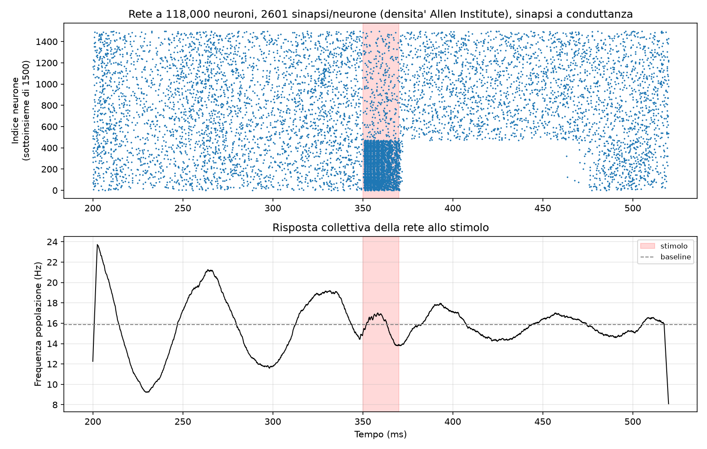

# From communication between two neurons to a learned decision policy

A complete computational neural simulation journey — from the scale of a single neuron up to 40 million, from single-signal propagation up to a rudimentary reinforcement-learning policy.

**Author:** Andrea Corti — University of Pavia (TLB / Physics)
**Period:** September 2026
**Environment:** Python 3.14, Brian2 2.10.1, NumPy, SciPy, Matplotlib — MacBook Air M5, 24 GB RAM



*(Italian version: [`README.md`](README.md). The full extended report is only available in Italian for now — [`report/resoconto_progetto_ESTESO.pdf`](report/resoconto_progetto_ESTESO.pdf) — but see [`report/PROJECT_SUMMARY_EN.md`](report/PROJECT_SUMMARY_EN.md) for an English-language synthesis of the whole project, written with an international audience in mind.)*

## What this repository contains

Thirty-plus progressive experiments, each building on the previous one, with every result verified by actually running the code (not just written down):

- **Basic communication:** synaptic threshold, short-term plasticity, propagation, temporal summation
- **Learning:** STDP, pattern classification
- **Scale:** balanced E/I network up to 40 million neurons (57% of mouse-brain scale)
- **Spatial structure:** small-world connectivity, 3D brain-like shape, interactive visualizations
- **Attractors:** verified ring attractor (persistence, multistability, robustness), chains of linked attractors
- **Decision-making:** competition between alternatives, reinforcement learning, contextual policy
- **Final synthesis:** spatial structure + biophysically realistic synapses + synaptic density matching the most advanced published model to date (Kuriyama, Akira et al. 2025)
- **Learned bidirectional communication (spiking domain):** from total failure to a full solution (transmission switch + homeostatic normalization + emergency suppression), verified on 8 independent seeds, extended to multiple messages and a three-population network
- **Radiation physics (Geant4), integrated with the neural model:** clinical ion beams from CNAO (protons, carbon-12) impacting the same ring-attractor architecture, from the plateau up to the true Bragg peak — directly connected to the spiking network via a functional knockout experiment, producing a verified dose-response gradient, a recovery/compensatory-plasticity finding, a discovered point of no return, an RBE-LET model tied to the clinical methodology pioneered at NIRS/HIMAC (Chiba, Japan), and an honestly-documented Monte Carlo statistics limitation that was found and then corrected

The complete Italian report (almost 400 pages, every experiment explained in detail, full source code included, equations) is in [`report/resoconto_progetto_ESTESO.pdf`](report/resoconto_progetto_ESTESO.pdf) (also in [`.docx`](report/resoconto_progetto_ESTESO.docx) and in [LaTeX](latex/), compiled to [`latex/main.pdf`](latex/main.pdf)). A shorter description is in [`README.pdf`](README.pdf) (Italian).

## Repository structure

| Folder | Contents |
|---|---|
| [`/scripts`](scripts) | All Python scripts, one per experiment |
| [`/figures`](figures) | Plots produced by each experiment |
| [`/visualizations`](visualizations) | Interactive 3D visualizations (self-contained HTML) |
| [`/report`](report) | Full report (PDF/DOCX, Italian) and the English project summary |
| [`/geant4_cnao_ring`](geant4_cnao_ring) | Geant4 project (C++): physical impact of CNAO beams on the neural architecture — see the dedicated README ([English version](geant4_cnao_ring/README_EN.md)) |

## How to run

Every script is self-contained. Expected run times for the large-scale experiments:

- **40 million neurons:** ~10 minutes (single block) up to several hours (full multi-phase experiment, including thermal throttling)
- **118,000 neurons at realistic density:** ~20-25 minutes

```bash
pip install brian2 numpy scipy matplotlib --break-system-packages
python3 scripts/due_neuroni.py   # the simplest starting point
```

## Methodological note

The project deliberately includes failed attempts (an attractor that didn't work, an instability discovered at full scale and then fixed) alongside positive results — and, in the Geant4/CNAO thread, a methodological limitation (Monte Carlo statistics in the per-neuron dose map) that was found, honestly documented, and then corrected rather than hidden. A rigorously verified negative result is worth as much as a positive one — that discipline has guided the whole project.

## License

Personal project, for learning and portfolio purposes. Code freely reusable with attribution.
